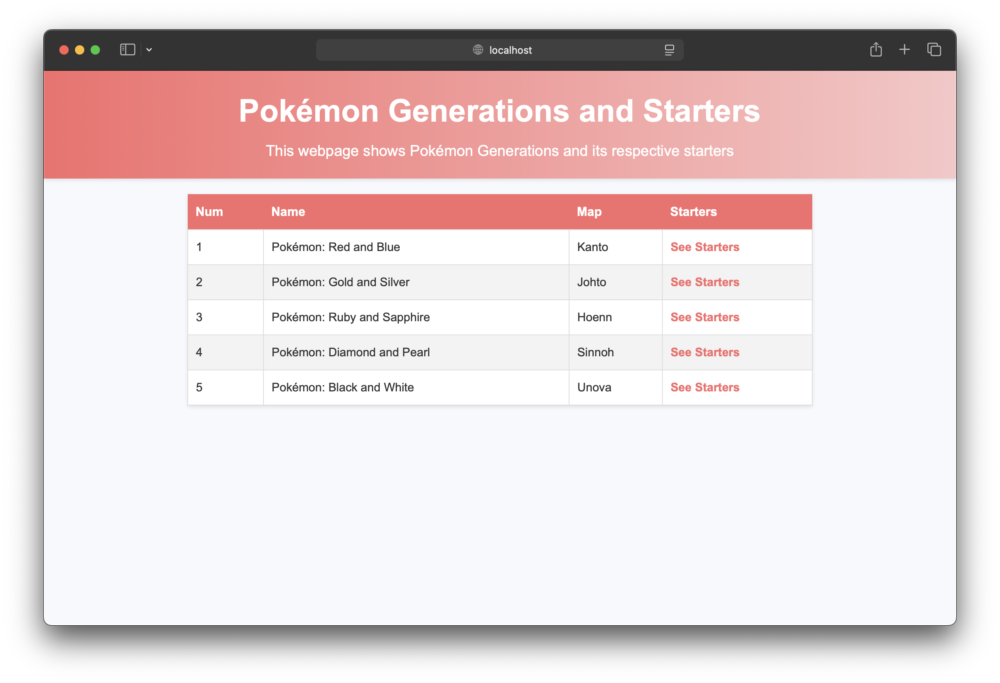
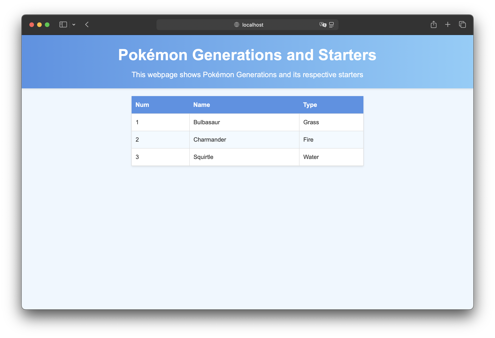

# Pokemon Generations & Starters

Luis Miguel Benítez, 2º DAM

## Índice

- [Descripción del Proyecto](#descripción-del-proyecto)
- [Ficheros de entrada](#ficheros-de-entrada)
- [Librerías, clases y dependencias utilizadas](#librerías-clases-y-dependencias-utilizadas)
- [Plantillas Thymeleaf](#plantillas-thymeleaf)
- [Ficheros de salida](#ficheros-de-salida)
- [Problemas resueltos y no resueltos](#problemas-resueltos-y-no-resueltos)
- [Recursos y blibliografía](#recursos-y-bibliografía)

## Descripción del proyecto

Este proyecto genera páginas web estáticas que muestra las generaciones de Pokémon y sus respectivos Pokémon iniciales.  
Utiliza archivos JSON para almacenar y validar los datos de las generaciones y los iniciales, y archivos INI para la configuración.
Las plantillas Thymeleaf se utilizan para generar las páginas HTML.

## Ficheros de entrada

Los archivos utilizados como fuente de datos para la generación de las páginas estáticas son los siguientes:

**config.ini**
```ini
[Pokemon Generations & Starters]
name = Pokémon Generations and Starters
description = This webpage shows Pokémon Generations and its respective starters
```

**pokemon-generations.json**
```
{
  "pokemon-generations": [
    {
      "generation-num": 1,
      "generation-name": "Pokémon: Red and Blue",
      "generation-map": "Kanto",
      "starters": [
        {
          "starter-num": 1,
          "starter-name": "Bulbasaur",
          "starter-type": "Grass"
        },
        {
          "starter-num": 2,
          "starter-name": "Charmander",
          "starter-type": "Fire"
        },
        {
          "starter-num": 3,
          "starter-name": "Squirtle",
          "starter-type": "Water"
        }
      ]
    },
    {
      "generation-num": 2,
      "generation-name": "Pokémon: Gold and Silver",
      "generation-map": "Johto",
      "starters": [
        {
          "starter-num": 4,
          "starter-name": "Chikorita",
          "starter-type": "Grass"
        },
        {
          "starter-num": 5,
          "starter-name": "Cyndaquil",
          "starter-type": "Fire"
        },
        {
          "starter-num": 6,
          "starter-name": "Totodile",
          "starter-type": "Water"
        }
      ]
    },
    {
      "generation-num": 3,
      "generation-name": "Pokémon: Ruby and Sapphire",
      "generation-map": "Hoenn",
      "starters": [
        {
          "starter-num": 7,
          "starter-name": "Treecko",
          "starter-type": "Grass"
        },
        {
          "starter-num": 8,
          "starter-name": "Torchic",
          "starter-type": "Fire"
        },
        {
          "starter-num": 9,
          "starter-name": "Mudkip",
          "starter-type": "Water"
        }
      ]
    },
    {
      "generation-num": 4,
      "generation-name": "Pokémon: Diamond and Pearl",
      "generation-map": "Sinnoh",
      "starters": [
        {
          "starter-num": 10,
          "starter-name": "Turtwig",
          "starter-type": "Grass"
        },
        {
          "starter-num": 11,
          "starter-name": "Chimchar",
          "starter-type": "Fire"
        },
        {
          "starter-num": 12,
          "starter-name": "Piplup",
          "starter-type": "Water"
        }
      ]
    },
    {
      "generation-num": 5,
      "generation-name": "Pokémon: Black and White",
      "generation-map": "Unova",
      "starters": [
        {
          "starter-num": 13,
          "starter-name": "Snivy",
          "starter-type": "Grass"
        },
        {
          "starter-num": 14,
          "starter-name": "Tepig",
          "starter-type": "Fire"
        },
        {
          "starter-num": 15,
          "starter-name": "Oshawott",
          "starter-type": "Water"
        }
      ]
    }
  ]
}
```

**pokemon-generations-schema**
```
{
  "$schema": "http://json-schema.org/draft-04/schema#",
  "type": "object",
  "properties": {
    "pokemon-generations": {
      "type": "array",
      "items": {
        "type": "object",
        "properties": {
          "generation-num": {
            "type": "integer"
          },
          "generation-name": {
            "type": "string"
          },
          "generation-map": {
            "type": "string"
          },
          "starters": {
            "type": "array",
            "items": {
              "type": "object",
              "properties": {
                "starter-num": {
                  "type": "integer"
                },
                "starter-name": {
                  "type": "string"
                },
                "starter-type": {
                  "type": "string"
                }
              }
            }
          }
        }
      }
    }
  }
}
```

## Librerías, clases y dependencias utilizadas

### Librerías

- **Thymeleaf** es utilizado como motor de plantillas para la creación de los archivos HTML.
- **JSON Schema Validator** es utilizado para validar que el archivo json con el contenido sigue el esquema del archivo json que define la estructura qeu deben de presentar los datos.
- **Rome** es utilizado para la creación del RSS.

### Clases

Las clases se pueden encontrar dentro de la carpeta `model`.

- `PokemonData.java` representa los datos de las generaciones de Pokémon.
- `Generation.java` representa cada generación de Pokémon.
- `Starter.java` representa cada Pokémon inicial.

### Dependencias

        <dependency>
            <groupId>org.thymeleaf</groupId>
            <artifactId>thymeleaf</artifactId>
            <version>3.1.2.RELEASE</version>
        </dependency>
        <dependency>
            <groupId>com.fasterxml.jackson.core</groupId>
            <artifactId>jackson-core</artifactId>
            <version>2.17.2</version>
        </dependency>
        <dependency>
            <groupId>com.fasterxml.jackson.core</groupId>
            <artifactId>jackson-annotations</artifactId>
            <version>2.17.2</version>
        </dependency>
        <dependency>
            <groupId>com.fasterxml.jackson.core</groupId>
            <artifactId>jackson-databind</artifactId>
            <version>2.17.2</version>
        </dependency>
        <dependency>
            <groupId>org.slf4j</groupId>
            <artifactId>slf4j-api</artifactId>
            <version>1.7.32</version>
        </dependency>
        <dependency>
            <groupId>com.github.erosb</groupId>
            <artifactId>everit-json-schema</artifactId>
            <version>1.14.4</version>
        </dependency>
        <dependency>
            <groupId>com.rometools</groupId>
            <artifactId>rome</artifactId>
            <version>2.1.0</version>
        </dependency>
        <dependency>
            <groupId>org.slf4j</groupId>
            <artifactId>slf4j-simple</artifactId>
            <version>2.0.9</version>
        </dependency>

## Plantillas Thymeleaf

Thymeleaf es un motor de plantillas para Java que permite crear archivos HTML.
En este proyecto existen dos plantillas utilizadas para la generación de páginas estáticas:

Para la página principal (`index.html`) Thymeleaf hace uso de `templateGenerations.html` para crear la lista de generaciones Pokémon:
```
<!doctype html>
<html lang="en" xmlns:th="http://www.thymeleaf.org">
<head>
    <meta charset="UTF-8">
    <meta name="viewport" content="width=device-width, initial-scale=1">
    <title>Generations</title>
    <link rel="stylesheet" type="text/css" href="/styles/styleTemplateGenerations.css">
</head>
<body>
    <header>
        <h1 th:text="${name}"></h1>
        <p th:text="${description}"></p>
    </header>
    <main>
        <table>
            <thead>
            <tr>
                <th>Num</th>
                <th>Name</th>
                <th>Map</th>
                <th>Starters</th>
            </tr>
            </thead>
            <tbody>
            <tr th:each="generation : ${generations}">
                <td th:text="${generation.generationNum}"></td>
                <td th:text="${generation.generationName}"></td>
                <td th:text="${generation.generationMap}"></td>
                <td><a th:href="@{'details_' + ${generation.generationNum} + '.html'}">See Starters</a></td>
            </tr>
            </tbody>
        </table>
    </main>
</body>
</html>
```

Para cada una de las generaciones, Thymeleaf hace uso de `templateStarters.html` y genera una página para los Pokémon iniciales de cada generación:
```
<!doctype html>
<html lang="en" xmlns:th="http://www.thymeleaf.org">
<head>
    <meta charset="UTF-8">
    <meta name="viewport" content="width=device-width, initial-scale=1">
    <title>Generations</title>
    <link rel="stylesheet" type="text/css" href="/styles/styleTemplateStarters.css">
</head>
<body>
    <header>
        <h1 th:text="${name}"></h1>
        <p th:text="${description}"></p>
    </header>
    <main>
        <table>
            <thead>
            <tr>
                <th>Num</th>
                <th>Name</th>
                <th>Type</th>
            </tr>
            </thead>
            <tbody>
            <tr th:each="starter : ${starters}">
                <td th:text="${starter.starterNum}"></td>
                <td th:text="${starter.starterName}"></td>
                <td th:text="${starter.starterType}"></td>
            </tr>
            </tbody>
        </table>
    </main>
</body>
</html>
```

## Ficheros de salida

Los archivos se crean dentro de resources, en una carpeta llamada "generated", incluyendo la página principal (index.html) y una pagina para cada una de las generaciones (details_[generation-num]).
Además de lo anterior, se crea también un archivo RSS (rss.xml).

La página principal que muestra las generaciones queda así:

La página para los iniciales de cada generación queda así:


## Problemas resueltos y no resueltos

### Problemas resueltos
- Schema Validation: El programa ahora comprueba si el contenido de `pokemon-generations.json` sigue la estructura de `pokemon-generations-schema.json`.
- RSS Feed: El archivo RSS ahora se crea usando una librería específica para la creación de RSS.

### Problemas por resolver
En este momento el programa no tiene ningún problema por resolver.

## Recursos y bibliografía

https://belief-driven-design.com/thymeleaf-part-1-basics-3a1d9/  
https://github.com/everit-org/json-schema  
https://www.youtube.com/watch?v=6HNUqDL-pI8  
https://www.blackslate.io/articles/create-rss-feeds-in-java-using-rome